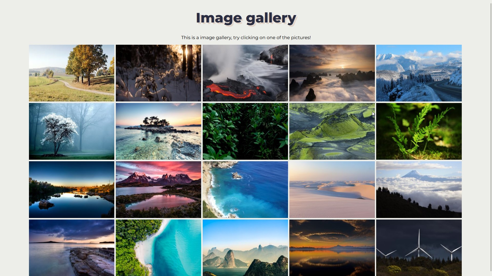

# Gallery

For this project we were tasked with creating a website using CSS' grid functionality. So for this task I decided to create a gallery.

I added some javascript functionality to it which wasn't a part of the task. Just to add some functionality that let's the users expand the images. But not quite that either. I made smaller sample copies of each image that I used for this gallery. When the user clicks on one of these sample images the image will be replaced by the large original copy of the image. This was to reduce the file size upon loading the site for the first time.

